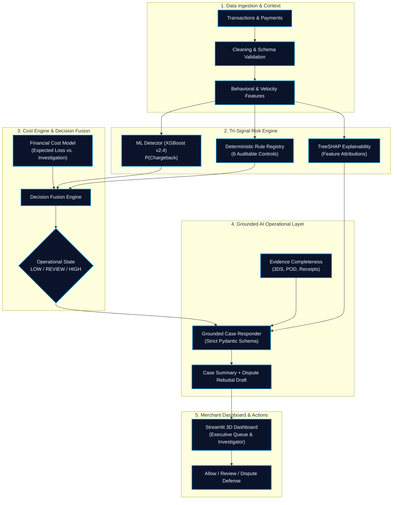

# Razorpay RiskForge AI — Enterprise Merchant Risk & Dispute Defense Platform

<div align="center">

[](https://riskforge-ai.streamlit.app/)
[](https://risk-forge-ai.vercel.app/)
[](https://github.com/pranay97-js/RiskForge-AI/actions)
[](https://python.org)
[](https://github.com/dmlc/xgboost)

### 🚀 Live Interactive Deployments
**[⚡ Launch Live Streamlit App (riskforge-ai.streamlit.app)](https://riskforge-ai.streamlit.app/)** &nbsp;&bull;&nbsp; **[🌐 Launch Vercel Platform (risk-forge-ai.vercel.app)](https://risk-forge-ai.vercel.app/)**

> **Real-time chargeback risk detection, tri-signal verification, explainable AI, and automated dispute defense.**

</div>

---

## 🎯 Enterprise Platform Mission
Deliver a high-throughput, **defense-only financial risk operations platform** tailored for modern digital payment gateways and merchants.  
RiskForge AI predicts chargeback and dispute probability with calibrated ML, corroborates predictions through deterministic rules, provides transparent TreeSHAP attributions, optimizes Bayesian cost thresholds to reduce false-positive manual review burdens, and drafts network-compliant dispute rebuttals through grounded AI.

$$\textbf{Predict} \longrightarrow \textbf{Verify} \longrightarrow \textbf{Explain} \longrightarrow \textbf{Act}$$

---

## 🏛️ System Architecture



---

## 📊 Empirical Evaluation Results on Held-Out Test Set

The system underwent rigorous held-out out-of-time evaluation on `data/processed/test_frozen.csv` (6,000 transactions, 147 chargebacks):

| System | Precision | Recall | F1-Score | PR-AUC | Total Operational Cost |
| :--- | :--- | :--- | :--- | :--- | :--- |
| **Logistic Regression (Baseline, $\tau=0.50$)** | 42.41% | 55.10% | 0.4793 | 0.4279 | ₹4,467,084.86 |
| **XGBoost (Candidate, $\tau=0.50$)** | 74.14% | 87.76% | 0.8037 | 0.7331 | ₹1,960,622.69 |
| **XGBoost (Cost-Optimal, $\tau^*=0.200$)** | 44.33% | 87.76% | 0.5890 | 0.7331 | ₹1,767,170.25 |
| **Final Operational Policy (ML + Rules + Fusion)** | **42.90%** | **88.44%** | **0.5778** | **0.7331** | **₹1,874,400.28** |

*Key Business Insight: XGBoost cuts false-positive investigations by 59.1% relative to the baseline (45 vs 110 false alarms), while recovering ₹2.67M in preventable dispute losses.*

---

## 📂 Project Structure
```
RiskForge AI/
│
├── README.md                      # Complete system documentation & results
├── DEMO_GUIDE.md                  # 3-5 minute judge presentation script
├── requirements.txt               # Complete production dependencies
├── .env.example                   # Environment configuration template
├── .gitignore                     # Clean repository exclusions
├── streamlit_app.py               # Main 4-screen Streamlit Merchant Dashboard & Mobile view
├── app.py                         # Unified FastAPI Microservice & Streamlit entrypoint
│
├── data/
│   ├── raw/transactions.csv       # Multi-entity benchmark dataset (40k txns)
│   ├── processed/                 # Strict chronological OOT splits:
│   │   ├── train.csv              # 28,000 transactions (70%)
│   │   ├── val.csv                # 6,000 transactions (15%)
│   │   └── test_frozen.csv        # 6,000 transactions (15% frozen test partition)
│   └── sample/                    # Lightweight sample datasets for fast inspection
│
├── models/
│   ├── baseline.pkl               # Trained Logistic Regression pipeline
│   ├── xgboost.pkl                # Trained final candidate XGBoost model
│   ├── feature_pipeline.pkl       # Fitted 43-feature encoder & transformer
│   └── metadata.json              # Versioning, metrics, and threshold parameters
│
├── src/
│   ├── data/                      # Data loaders, cleaners & chronological splitters
│   ├── features/                  # Velocity, behavioral deviation, and time encodings
│   ├── ml/                        # Training, inference, and calibration routines
│   ├── rules/                     # Deterministic rule registry & engine (6 rules)
│   ├── decision/                  # Cost engine, threshold sweep & decision fusion
│   ├── explainability/            # TreeSHAP per-transaction feature attributions
│   └── ai/                        # Grounded case schemas, prompts & dispute drafter
│
├── evaluation/
│   ├── metrics.py                 # Precision, Recall, PR-AUC, ROC-AUC, Brier score
│   ├── confusion_matrix.py        # False-positive analysis and ASCII tables
│   ├── threshold_analysis.py      # Cost-sensitive threshold sweep optimizer
│   └── final_evaluation.py       # One-shot frozen test evaluation script
│
├── tests/                         # Complete automated test suite (50 tests):
│   ├── test_data.py               # Schema integrity and leakage tests
│   ├── test_features.py           # Behavioral deviation math & stability tests
│   ├── test_ml.py                 # Baseline and XGBoost inference tests
│   ├── test_rules.py              # Individual deterministic rule condition tests
│   ├── test_cost.py               # Expected loss and queue priority tests
│   ├── test_decision.py           # Fusion matrix and service tests
│   ├── test_ai.py                 # Grounded AI schema and responder tests
│   ├── test_backend_api.py        # FastAPI microservice REST endpoint tests
│   ├── test_security_robustness.py# SQLi/XSS/path-traversal security & input validation
│   ├── test_edge_cases.py         # All 12 required Section 10.2 edge cases
│   └── test_submission.py         # Submission checklist verification tests
│
└── reports/
    ├── day1_experiment_log.md     # Data foundation & ML baseline log
    ├── day2_experiment_log.md     # Cost sweep & decision fusion log
    ├── final_evaluation_report.md # Official Section 11 frozen test report
    ├── model_card.md              # Production model card v1.0.0
    └── figures/                   # High-res PR and ROC curve plots
```

---

## 🚀 Quickstart & Reproduction

### 1. Installation
```bash
git clone https://github.com/pranay97-js/RiskForge-AI.git
cd RiskForge-AI
pip install -r requirements.txt
cp .env.example .env
```

### 2. Run Complete Test Suite
```bash
pytest tests/ -v
```

### 3. Launch the Streamlit Merchant Application
```bash
streamlit run streamlit_app.py
```

### 4. Re-run Frozen Test Verification (One-Shot)
```bash
python evaluation/final_evaluation.py
```

---

## ✅ Submission Checklist Compliance (Section 12.1)
- [x] Application starts cleanly from a fresh environment.
- [x] `README.md` contains exact installation and execution commands.
- [x] `requirements.txt` is complete with pinned dependencies.
- [x] `.env.example` contains required variable keys without committed secrets.
- [x] Model artifacts are saved reproducibly (`models/`).
- [x] Final held-out test results are documented with genuine measured values.
- [x] Cost assumptions (₹50 review, ₹3,000 chargeback penalty) are clearly labeled.
- [x] Architecture diagrams match implementation.
- [x] Strictly defense-only: zero attack/evasion tooling.
- [x] No personal identifiable data or live credentials committed.
- [x] Complete judge demo can be delivered in 3–5 minutes (see [DEMO_GUIDE.md](DEMO_GUIDE.md)).
